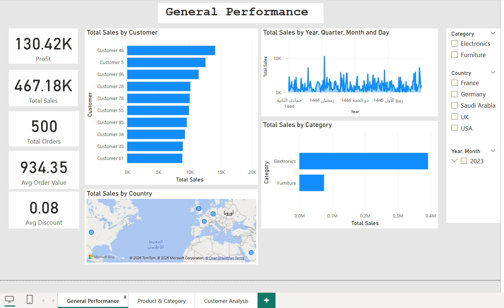
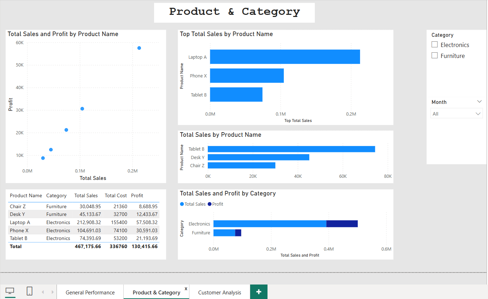
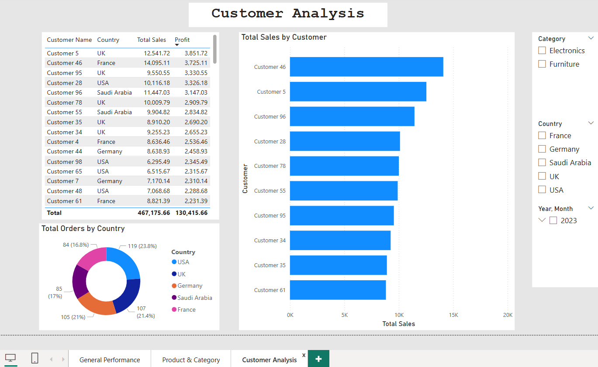

 📊 E-commerce Sales Analysis - Training Project

This project focuses on analyzing sales data for an e-commerce business, aiming to provide insights into customer behavior, product performance, and sales trends.

---

## 🎯 Project Goal:
To create an interactive Power BI report that helps visualize key sales metrics and supports data-driven decision making.

---

## 🧰 Skills & Tools Used:
- Power BI Desktop
- Data Cleaning with Power Query
- Data Modeling & Relationships
- DAX Calculations (KPIs, Time Intelligence)
- Report Design & Visualizations

---

## 📷 Report Screenshots

### 📊 General Performance

### 📦 Product & Category

### 👥 Customer Analysis

---

## 📎 Files:
- Power BI file: `E-commerce-Project.pbix`
- Dashboard screenshots 

---

## 📝 Notes:
- The data is fictional and used for practice purposes.
